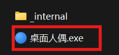
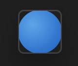
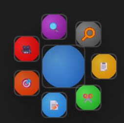
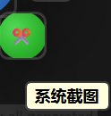

## 程序应用
点击 桌面人偶.exe  即可运行

在系统右下角会得到一个悬浮球

鼠标左键点击小球，出现功能小球

## 核心功能

1. **系统截屏**

      点击进入系统截图，使用系统自带功能编辑

<video controls src="./mp4/录屏_20260506_000450.mp4" title="系统截图" autoplay="true" muted="true"></video>

